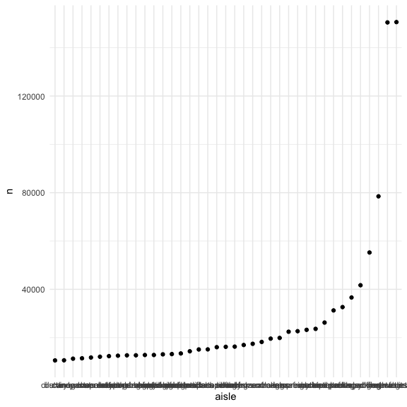

Homework 3
================
Nidhi Patel
10/6/2020

#### Problem 0

Follow the style rubric\!\!\!\!

#### Problem 1

``` r
data("instacart")
```

Instacart dataset logs 1,384,617 observations over 15 Instacart online
grocery order variables. It not only keeps track of the user, order
products, reorders, day and times of orders, but also organizes each
product into departments and aisles they would be in store. For example,
the product, Grated Pecorino Romano Cheese, fis found in the specialty
cheese aisle, which falls into the dairy eggs department. The least
ordered department is bulk, with 1,359 orders, while the most ordered
department is produce with 409,087 orders.

``` r
instacart %>% 
  count(aisle) %>% 
  filter(n > 10000) %>% 
  mutate(
    aisle = factor(aisle),
    aisle = fct_reorder(aisle, n)
  ) %>% 
  ggplot(aes(x = aisle, y = n)) +
  geom_point()
```


