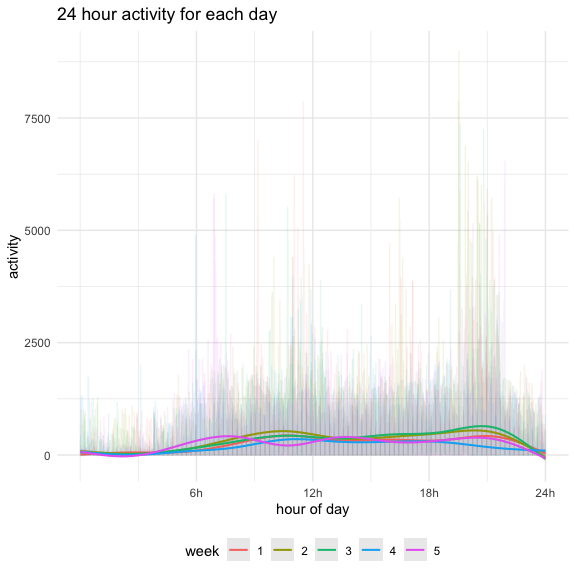

Homework 3
================
Nidhi Patel
10/6/2020

#### Problem 1

###### Describe data

``` r
data("instacart")
```

Instacart dataset logs 1384617 observations over 15 Instacart online
grocery order variables. It not only keeps track of the user, order
products, reorders, day and times of orders, but also organizes each
product into departments and aisles they would be in store. For example,
the product, Grated Pecorino Romano Cheese, is found in the specialty
cheese aisle, which falls into the dairy eggs department. The least
ordered department is bulk, with 1,359 orders, while the most ordered
department is produce with 409,087 orders.

###### How many aisles? What is the most ordered aisle?

``` r
instacart %>% 
  count(aisle) %>% 
  arrange(desc(n))
```

    ## # A tibble: 134 x 2
    ##    aisle                              n
    ##    <chr>                          <int>
    ##  1 fresh vegetables              150609
    ##  2 fresh fruits                  150473
    ##  3 packaged vegetables fruits     78493
    ##  4 yogurt                         55240
    ##  5 packaged cheese                41699
    ##  6 water seltzer sparkling water  36617
    ##  7 milk                           32644
    ##  8 chips pretzels                 31269
    ##  9 soy lactosefree                26240
    ## 10 bread                          23635
    ## # … with 124 more rows

There are 134 aisles. The fresh vegetables aisle is most ordered from
with 150609 orders.

###### Plot aisle orders

``` r
instacart %>% 
  count(aisle) %>% 
  filter(n > 10000) %>% 
  mutate( #this reorders the x axis.
    aisle = factor(aisle), #make it a factor
    aisle = fct_reorder(aisle, n) 
  ) %>% 
  ggplot(aes(x = aisle, y = n)) +
  labs(
    y = "number of items",
    title = "number of items ordered in each aisle"
) +
  geom_point() +
  theme(axis.text.x = element_text(angle = 60, hjust = 1))
```


This plot resembles an exponential graph because the most ordered from
aisles are much greater than the others. I find it interesting (and
nice) that the most ordered items are fresh vegetables, followed by
fresh fruit. Coming in third are packaged fruits and vegetables\!
Instacart users seem to like their vegetables\!\!

###### Top orders from baking ingredients, dog food care and packaged vegetable fruits aisles

``` r
instacart %>% 
  filter(aisle %in% c("baking ingredients", "dog food care", "packaged vegetables fruits")) %>% 
  group_by(aisle, product_name) %>% #so, the order of aisle, product_name matters?
  summarize(n = n()) %>% 
  mutate(rank = min_rank(desc(n))) %>% 
  filter(rank < 4) %>% 
  arrange(aisle, rank) %>% 
  knitr::kable()
```

    ## `summarise()` regrouping output by 'aisle' (override with `.groups` argument)

| aisle                      | product\_name                                 |    n | rank |
| :------------------------- | :-------------------------------------------- | ---: | ---: |
| baking ingredients         | Light Brown Sugar                             |  499 |    1 |
| baking ingredients         | Pure Baking Soda                              |  387 |    2 |
| baking ingredients         | Cane Sugar                                    |  336 |    3 |
| dog food care              | Snack Sticks Chicken & Rice Recipe Dog Treats |   30 |    1 |
| dog food care              | Organix Chicken & Brown Rice Recipe           |   28 |    2 |
| dog food care              | Small Dog Biscuits                            |   26 |    3 |
| packaged vegetables fruits | Organic Baby Spinach                          | 9784 |    1 |
| packaged vegetables fruits | Organic Raspberries                           | 5546 |    2 |
| packaged vegetables fruits | Organic Blueberries                           | 4966 |    3 |

Light brown sugar, Snack Sticks Chicken & Rice Recipe dog treats and
organic baby spinach are the most ordered items from baking ingredients,
dog food care and packaged vegetable fruits aisles. Packaged fruits and
vegetables are more ordere than the other two. Dog food care is the
least ordered from aise; maybe dog lovers probably buy treats while
walking their dogs\!\!

###### When are apples and ice cream typically ordered?

``` r
dow = tibble(
    order_dow = 0:6,
    day = c("Sunday", "Monday", "Tuesday", "Wednesday", "Thurday", "Friday", "Saturday")
  )

 instacart = left_join(
    instacart, 
    dow,
    by = "order_dow"
  )

instacart %>% 
  filter(product_name %in% c("Pink Lady Apples", "Coffee Ice Cream")) %>% 
  group_by(product_name, day, order_dow) %>% 
  summarize(mean_hod = mean(order_hour_of_day)) %>% 
  arrange(order_dow) %>% 
  select(product_name, day, mean_hod) %>% 
  pivot_wider(
    names_from = "day",
    values_from = "mean_hod"
  ) %>% 
  knitr::kable()
```

    ## `summarise()` regrouping output by 'product_name', 'day' (override with `.groups` argument)

| product\_name    |   Sunday |   Monday |  Tuesday | Wednesday |  Thurday |   Friday | Saturday |
| :--------------- | -------: | -------: | -------: | --------: | -------: | -------: | -------: |
| Coffee Ice Cream | 13.77419 | 14.31579 | 15.38095 |  15.31818 | 15.21739 | 12.26316 | 13.83333 |
| Pink Lady Apples | 13.44118 | 11.36000 | 11.70213 |  14.25000 | 11.55172 | 12.78431 | 11.93750 |

Instacart users tend to order pink lady apples earlier in the day than
ice cream.

#### Problem 2

###### Tidy and data wrangle

``` r
accel =
  read_csv("./accel_data.csv") %>% 
  janitor::clean_names() %>% 
  pivot_longer(
    activity_1:activity_1440,
    names_to = "minute",
    names_prefix = "activity_",
    values_to = "activity"
  ) %>% 
  mutate(
    day = factor(day),
    minute = as.integer(minute),
    week = factor(week),
    day_id = factor(day_id),
    weekday = ifelse(day == "Saturday" | day == "Sunday", rep(FALSE), TRUE)
    )
```

    ## Parsed with column specification:
    ## cols(
    ##   .default = col_double(),
    ##   day = col_character()
    ## )

    ## See spec(...) for full column specifications.

The original version of this dataset contained 1436 columns and 25 rows.
Activity was spread across 1440 columns and subsequently tidied into
columns: minutes and activities. The resulting data has 50400 rows with
6 activity observations. The variables ‘week’, ‘day\_id’, and ‘day’ were
converted to factors; ‘minute’ was converted to an integer. These were
converted to factors to ease further wrangling and visualization.
Activity was kept as an integer. Finally a logical variable of ‘weekday’
was added to differentiate weekdays from weekends.

###### Total activity variable for each day

``` r
activity =
  accel %>% 
  group_by(day, week) %>% 
  summarize(tot_act = sum(activity)) %>% 
  pivot_wider(
    names_from = "day",
    values_from = "tot_act"
  ) %>% 
  select(week, Monday, Tuesday, Wednesday, Thursday, Friday, Saturday, Sunday)
```

    ## `summarise()` regrouping output by 'day' (override with `.groups` argument)

``` r
knitr::kable(activity) #it wouldn't display the table when i knit if i piped and left () blank.
```

| week |    Monday |  Tuesday | Wednesday | Thursday |   Friday | Saturday | Sunday |
| :--- | --------: | -------: | --------: | -------: | -------: | -------: | -----: |
| 1    |  78828.07 | 307094.2 |    340115 | 355923.6 | 480542.6 |   376254 | 631105 |
| 2    | 295431.00 | 423245.0 |    440962 | 474048.0 | 568839.0 |   607175 | 422018 |
| 3    | 685910.00 | 381507.0 |    468869 | 371230.0 | 467420.0 |   382928 | 467052 |
| 4    | 409450.00 | 319568.0 |    434460 | 340291.0 | 154049.0 |     1440 | 260617 |
| 5    | 389080.00 | 367824.0 |    445366 | 549658.0 | 620860.0 |     1440 | 138421 |

A pattern may be more consistent activity during the weekdays opposed to
weekend, which varied greatly week by week. I think it’s interesting
that the last two Saturday’s recorded the same exact amount of activity
and they it was extremely lower than anything else recorded. I wonder if
this outlier is a mistake?

###### Plot 24-hour activity time

``` r
accel %>% 
  group_by(day) %>% 
  ggplot(aes(x = minute, y = activity, color = week)) +
  geom_line(alpha = 0.1, size = 0.5) +
  stat_smooth(alpha = 0.2, size = 0.7) +
  scale_x_continuous(
    breaks = c(360, 720, 1080, 1440),
    labels = c("6h", "12h", "18h", "24h")
  ) +
  labs(
    title = "24 hour activity for each day",
    x = "hour of day"
  )
```

    ## `geom_smooth()` using method = 'gam' and formula 'y ~ s(x, bs = "cs")'



``` r
  theme(axis.text.x = element_text(angle = 60, hjust = 1))
```

    ## List of 1
    ##  $ axis.text.x:List of 11
    ##   ..$ family       : NULL
    ##   ..$ face         : NULL
    ##   ..$ colour       : NULL
    ##   ..$ size         : NULL
    ##   ..$ hjust        : num 1
    ##   ..$ vjust        : NULL
    ##   ..$ angle        : num 60
    ##   ..$ lineheight   : NULL
    ##   ..$ margin       : NULL
    ##   ..$ debug        : NULL
    ##   ..$ inherit.blank: logi FALSE
    ##   ..- attr(*, "class")= chr [1:2] "element_text" "element"
    ##  - attr(*, "class")= chr [1:2] "theme" "gg"
    ##  - attr(*, "complete")= logi FALSE
    ##  - attr(*, "validate")= logi TRUE

There are 35 x 1440 points of data to this plot, so it is difficult to
differentiate day by day. However, by the spikes and lulls of activity,
it looks like there is less activity in the morning and more midday and
evening. Maybe this can be attributed to sleeping during the early
morning?

#### Problem 3

###### Describe data

``` r
library(p8105.datasets)
data("ny_noaa")
```

This dataset covers nearly 30 years of weather in New York state with 7
columns of weather station, date, precipitation, snowfall, snow depth,
maximum and minimum temperature. There are a total of 2595176
observations. There are quite a new missing data points, especially in
minimum and maximum temperature. It seems that this issue is pertinent
to certain weather stations.

###### Data cleaning

``` r
ny_noaa = ny_noaa %>%
separate(date, into = c("year", "month", "day"), convert = TRUE) %>% 
  mutate(
    tmin = (as.integer(tmin) / 10),
    tmax = (as.integer(tmax) / 10),
    prcp = prcp / 10)

mostsnow = ny_noaa %>% 
  count(snow, sort = TRUE)
```

The most commonly observed value is 0 mm of snow. This makes a lot of
sense because it only snows a quarter of the year\! The second and third
most recorded values are 25 mm and 13 mm, respectively.

###### Average max temp in jan and july across years

``` r
 tmax_noaa = 
  ny_noaa %>% 
  filter(month %in% c("1", "7")) %>% 
  mutate(
    month = recode(
      month,
      `1` = "January",
      `7` = "July")) %>% 
  group_by(month, year, id) %>% 
  summarize(
    mean_tmax = mean(tmax, na.rm = TRUE)
  ) %>% 
  ggplot(aes(x = year, y = mean_tmax, color = id, alpha = 0.3)) + 
  geom_path() +
  labs(
    title = "average ax temperature in January in July across various NYS weather stations",
    y = "max temperature"
  ) +
  facet_grid(month ~ .) +
  theme(legend.position = "none")
```

    ## `summarise()` regrouping output by 'month', 'year' (override with `.groups` argument)

There are many many weather stations across New York in this dataset,
and therefore it is difficult to see each individual station. However,
the intense overlapping does allow us to see the range in max
temperatures across the state, which looks pretty consistent through the
years. The range in temperature differs more in January across the state
than in July. In January, there is an outlier in 1982 and a few in the
2000’s. The most distinct outlier in the plot in July 1987 : the temp
dropped below 15C\!\!

###### tmax vs tmin

``` r
library(patchwork)
library(ggridges)

tvt = ny_noaa %>% 
  drop_na(tmin, tmax) %>% 
  ggplot(aes(x = tmin, y = tmax)) + 
  geom_hex() +
  theme(legend.position = "right") +
  labs(
    title = "min vs max temperatures",
    x = "min temp (C)",
    y = "max temp (C)"
  )

distrib = ny_noaa %>% 
  filter(snow > 0 & snow < 100) %>% 
  ggplot(aes(x = snow, y = year, group = year)) + 
  geom_density_ridges(scale = 0.85) +
  labs(
    title = "distribution of snowfall",
    x = "snow(mm)"
  )

tvt + distrib
```

    ## Picking joint bandwidth of 3.76


“Min vs max temperatures” shows the most common minimum and maximum
temperature differences in New York. The most frequently recurring
temperatures in a day are around \~23C and \~7C. I find most interesting
min/max combination to be 60C and -29C, what a range\!\! The
“distribution of snowfall” graph is also interesting as the last 5
years (2005-2010), have had much fewer snowfalls of 70-80mm than the
years prior. It is also interesting to see that there is a dip in
snowfall at 20mm every year\!\!
